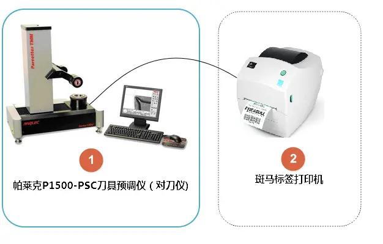
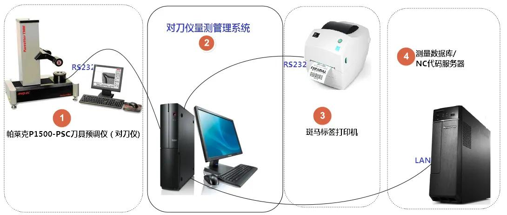

# Knife_setter 对刀仪技改项目

## 帕莱克 P1500-PSC 对刀仪的量测管理方案
客户：某世界500强医疗器械公司苏州工厂 。 

针对 Parlec 帕莱克 P1500-PSC 刀具对刀仪，进行技术改造，完成对测量结果的管理和 NC 代码的自动生成。客户反馈相当不错。如果有谁需要定制开发，可以联系我，`liuzhongwu2008@163.com.`

## 简述一下技改的背景以及目标

大家都知道，机械加工刀具都会有磨损的，在加工中心加工之前都需要先量测一下刀具的一些关键尺寸 (比如高度 / 半径 / 夹角等). 然后根据这些尺寸对加工程序 (NC 程序) 进行微调，这样才能保证加工产品尺寸精度.

客户公司有一台 Parlec 帕莱克 P1500-PSC 对刀仪，该对刀仪套件包括一个测量支架、光栅头、LED 显示器，当然还有一个测量软件。该软件能将测量结果打印到标签纸上.

简述一下技改之前的使用的场景：操作人员先用该对刀仪量测刀具尺寸，然后将测量结果打印到标签纸上，再拿着便签纸到加工中心上将量测值输入到 NC 文件中，懂行的人都明白，这些量测值精度都很高，小数点后好几位，另外在加工中心的输入这些数值可不像电脑那么方便。总体来讲，这种模式效率很低，而且容易出错.

在了解了现状后，我给了一个技改方案：一图胜千言，先上图.

在这个方案中， 我引入了一台电脑 + 对刀仪量测管理系统，即上图的 (2) 部分。该量测管理系统能自动提取出帕莱克量测仪的数值，并可以将测量数值传到该公司的测量数据库中，同时生成加工中心 NC 代码，并上传 NC 代码到服务器上，(该客户的测量数据库和 NC 代码服务器是一个机器).

## 技改难点:

### 1. 如何自动获取对刀仪的测量值？ 

Parlec 帕莱克 P1500-PSC 的操作系统并不是通用的 Windows/Linux, 应该是某类嵌入式操作系统，我们不可能在该操作系统上开发一个软件，另外 Parlec 也不提供外部 API 来获取测量值。这个问题困扰了大半天时间，最后还是让我很巧妙的解决了，  Parlec 自带的软件有一个打印功能，可以通过 RS232 接口打印到斑马打印机上，我分析了 RS232 的信号输出，成功地提取了测量的各个数值.

### 2. 如何自动化整个流程，改进效率，减少人为错误.

解决了测量值捕获问题，其实仅仅是一个技术难点，对于客户而言，更关心的是另一个问题：如何最大程度地减少操作人员的手工输入，减少因手工操作引起的错误.

我提出了一个流程改进方案，得到了客户的认可。方案为：为刀具贴一个二维码，该二维码上包含多个信息，具体为：Machine_ID+Product_ID+Tool_No. 扫描这个二维码就知道该刀具将用在哪个加工中心上，用来加工哪个产品，以及刀具自己的序号；在对刀仪量出刀具尺寸后，自动生成 NC 代码，并上传到文件服务器上. 

## 技改后的完整操作流程: 

 - 第一步：操作人员在量测管理系统上，扫描刀具二维码.  扫描之后，测量管理程序就知道要加工的产品 ID 和对应的加工中心，为生成 NC 代码做准备 (不同的产品，其 NC 代码模版是不一样的；不同加工中心的 NC 代码格式是不一样的)

 - 第二步：和技改之前一样，将刀具放在对刀仪上测量，测量完后，在 Parlec 测量软件上点击打印功能. 但和技改之前不同的是，该打印可不仅仅在标签纸上打印。在点击打印后，我们的量测程序量将自动捕获测量值，并将测量结果上传到客户的测量数据库中，同时生成 NC 代码，并上传到 NC 代码文件服务器上.

 - 第三步：操作人员到加工中心上，从文件服务器上调出我们生成的 NC 代码，进行加工. 

整个过程手工操作只有在加工中心选择 NC 代码，其他过程都是自动化.

最后，贴一张量测管理软件的截图. 

如果您有类似需求，可以联系我，`liuzhongwu2008@163.com`
